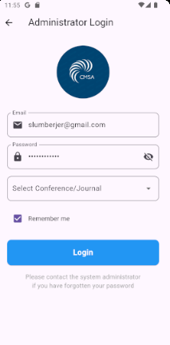
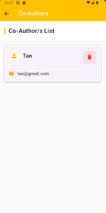
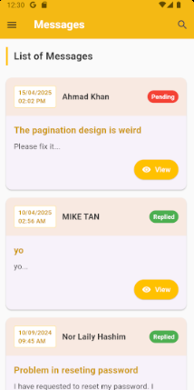
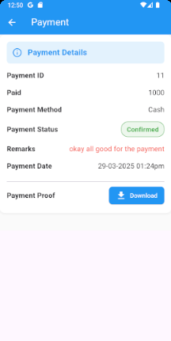
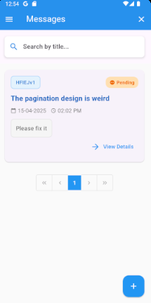

# Conference Management System

A comprehensive Flutter application for managing academic conferences, paper submissions, reviews, and publications.

## Demo/Screenshots

<table>
  <tr>
    <td align="center"><b>Main Login Screen</b></td>
  </tr>
  <tr>
    <td><br></td>
  </tr>
</table>

### Admin
<table>
  <tr>
    <td align="center"><b>Admin Login</b></td>
    <td align="center"><b>Admin Side Menu</b></td>
  </tr>
  <tr>
    <td><br></td>
    <td><br></td>
  </tr>
</table>

### Manage Conference
<table>
  <tr>
    <td align="center"><b>List of Conference</b></td>
    <td align="center"><b>Add Conference</b></td>
    <td align="center"><b>Edit Conference</b></td>
  </tr>
  <tr>
    <td><br></td>
    <td><br></td>
    <td><br></td>
  </tr>
</table>

### Manage News
<table>
  <tr>
    <td align="center"><b>List of News</b></td>
    <td align="center"><b>Add News</b></td>
    <td align="center"><b>Edit News</b></td>
  </tr>
  <tr>
    <td><br></td>
    <td><br></td>
    <td><br></td>
  </tr>
</table>

### Manage Papers
<table>
  <tr>
    <td align="center"><b>List of Papers</b></td>
    <td align="center"><b>Manage Paper Dashboard</b></td>
  </tr>
  <tr>
    <td><br></td>
    <td><br></td>
  </tr>
</table>
<table>
  <tr>
    <td align="center"><b>Paper Details</b></td>
    <td align="center"><b>Paper Review</b></td>
    <td align="center"><b>Paper Camera Ready</b></td>
    <td align="center"><b>Paper Publishing Management</b></td>
    <td align="center"><b>Paper Payment</b></td>
    <td align="center"><b>Paper Co-Authors</b></td>
  </tr>
  <tr>
    <td><br></td>
    <td><br></td>
    <td><br></td>
    <td><br></td>
    <td><br></td>
    <td><br></td>
  </tr>
</table>

### Manage User Account
<table>
  <tr>
    <td align="center"><b>List of Members</b></td>
    <td align="center"><b>Member Details</b></td>
    <td align="center"><b>List of Reviewer</b></td>
    <td align="center"><b>Reviewer Details</b></td>
  </tr>
  <tr>
    <td><br></td>
    <td><br></td>
    <td><br></td>
    <td><br></td>
  </tr>
</table>

### Manage Camera Ready & Payments
<table>
  <tr>
    <td align="center"><b>List of Camera Ready</b></td>
    <td align="center"><b>List of Payments</b></td>
  </tr>
  <tr>
    <td><br></td>
    <td><br></td>
  </tr>
</table>

### Manage Messages
<table>
  <tr>
    <td align="center"><b>List of Messages</b></td>
    <td align="center"><b>Messages Reply</b></td>
  </tr>
  <tr>
    <td><br></td>
    <td><br></td>
  </tr>
</table>

### Admin Settings
<table>
  <tr>
    <td align="center"><b>Settings</b></td>
  </tr>
  <tr>
    <td><br></td>
  </tr>
</table>

### User
<table>
  <tr>
    <td align="center"><b>User Login</b></td>
    <td align="center"><b>User Signup</b></td>
    <td align="center"><b>Reset Password</b></td>
    <td align="center"><b>User Side Menu</b></td>
  </tr>
  <tr>
    <td><br></td>
    <td><br></td>
    <td><br></td>
    <td><br></td>
  </tr>
</table>

### View News
<table>
  <tr>
    <td align="center"><b>List of News</b></td>
    <td align="center"><b>Add News</b></td>
  </tr>
  <tr>
    <td><br></td>
    <td><br></td>
  </tr>
</table>

### Manage Papers
<table>
  <tr>
    <td align="center"><b>List of Papers</b></td>
    <td align="center"><b>Paper Management Dashboard</b></td>
  </tr>
  <tr>
    <td><br></td>
    <td><br></td>
  </tr>
</table>
<table>
  <tr>
    <td align="center"><b>Paper Details</b></td>
    <td align="center"><b>Paper Review</b></td>
    <td align="center"><b>Paper Camera Ready</b></td>
    <td align="center"><b>Paper Payment</b></td>
    <td align="center"><b>Paper Co-Authors</b></td>
  </tr>
  <tr>
    <td><br></td>
    <td><br></td>
    <td><br></td>
    <td><br></td>
    <td><br></td>
  </tr>
</table>

### Manage Review
<table>
  <tr>
    <td align="center"><b>List of Review</b></td>
    <td align="center"><b>Review Details</b></td>
    <td align="center"><b>Review Rubrics</b></td>
  </tr>
  <tr>
    <td><br></td>
    <td><br></td>
    <td><br></td>
  </tr>
</table>

### Manage Messages
<table>
  <tr>
    <td align="center"><b>List of Messages</b></td>
    <td align="center"><b>Messages Details</b></td>
  </tr>
  <tr>
    <td><br></td>
    <td><br></td>
  </tr>
</table>

### Manage Profile
<table>
  <tr>
    <td align="center"><b>User Profile</b></td>
  </tr>
  <tr>
    <td><br></td>
  </tr>
</table>

## Features

- **Dual User Roles**: Separate interfaces for administrators and authors/reviewers
- **Conference Management**:
  - Create and edit conference details
  - Manage paper submissions and reviews
  - Set up review rubrics and fields
  - Publish news and announcements
- **Paper Submission System**:
  - Multi-step submission process
  - Co-author management
  - Camera-ready version uploads
  - Payment processing
- **Review System**:
  - Reviewer assignment
  - Structured review rubrics
  - Review feedback and remarks
- **User Management**:
  - User registration and profile management
  - Reviewer applications
  - Messaging system between users
- **Admin Dashboard**:
  - Comprehensive conference settings
  - Paper publishing management
  - User account administration
  - Payment tracking

## Technologies Used

- **Frontend**: Flutter/Dart
- **State Management**: Provider pattern with custom state services
- **Authentication**: Secure login and registration system
- **UI/UX**: Material Design 3 with custom gradients and animations

## Installation

1. **Prerequisites**:
   - Flutter SDK (latest version)
   - Dart SDK
   - Android Studio / VS Code with Flutter plugins
   - Git

2. **Clone the repository**:
   ```bash
   git clone https://github.com/yourusername/conference-management-system.git
   cd conference-management-system
   ```

3. **Install dependencies**:
   ```bash
   flutter pub get
   ```

4. **Run the application**:
   ```bash
   flutter run
   ```

## Project Structure

```
lib/
├── Admin/            # Admin-specific screens and functionality
├── User/             # User (author/reviewer) specific screens
├── service/          # Backend service connections
├── services/         # State management and shared services
└── main.dart         # Application entry point
```

## Usage

### For Administrators
- Login with admin credentials
- Create and manage conferences
- Review paper submissions
- Assign reviewers to papers
- Manage user accounts and payments

### For Authors
- Submit papers through a guided multi-step process
- Add co-authors
- Upload camera-ready versions
- Track review status
- Process payments

### For Reviewers
- Apply to become a reviewer
- Review assigned papers using rubrics
- Provide feedback and recommendations

## Contact

Name - Evan Tan - bcfeszjing@gmail.com

Project Link: [https://github.com/bcfeszjing/conference-management-system-application](https://github.com/bcfeszjing/conference-management-system-application)

## Acknowledgements

- [Flutter](https://flutter.dev/)
- [Material Design](https://material.io/)
